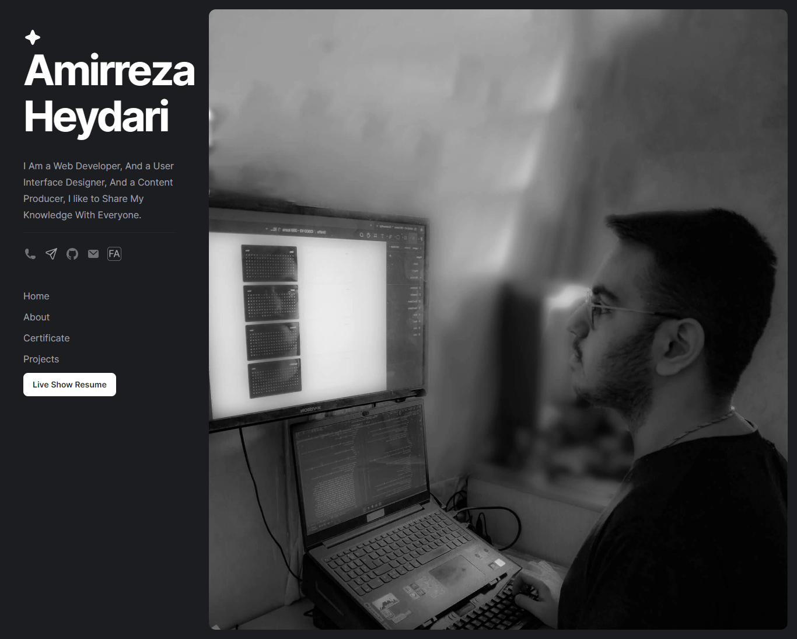

# Resume React Persian(RTL)

My resume Website Create Framework Reactjs

<a href="https://amirreza-heydari.clarotm.ir"> Live Demo </a>

## Changes applied

1. Changing the component class to functional component
2. Added loading to items
3. Added SEO and optimization
4. Added photo gallery and resume
5. Add random loading times
6. Create an error page
7. Set routes for created pages
8. Blog Archive Page Create

## log

- version 0.1.0 to 1.0.2
  - Create By reactjs
- version 1.0.3
  - Create By astro.js
- version 1.1.0
  - Create By Laravel
